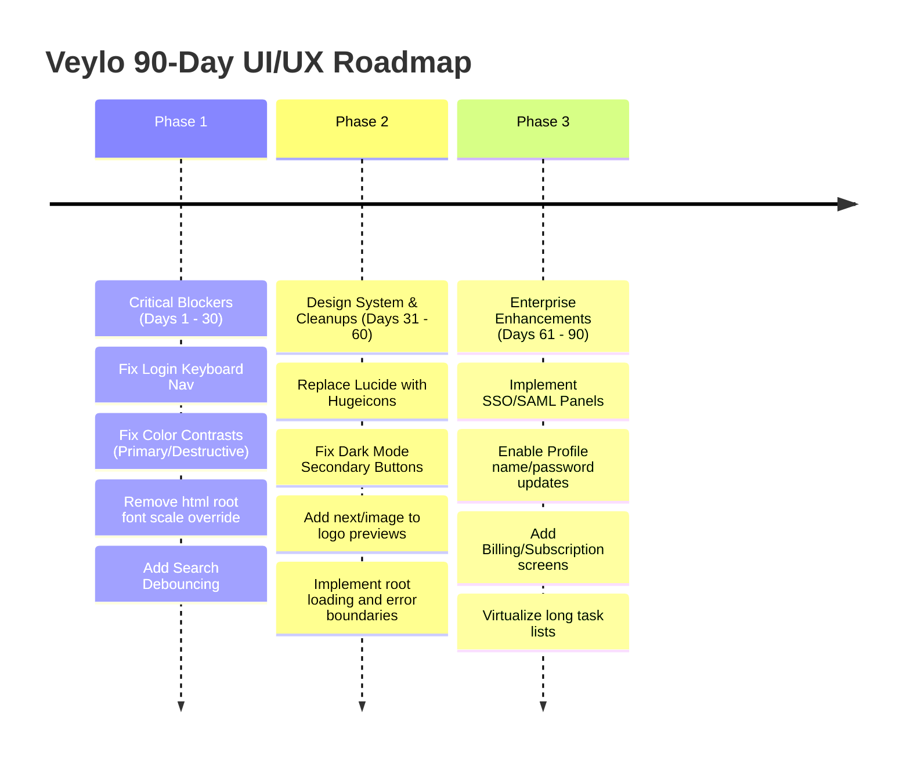

# VEYLO ENTERPRISE SaaS UI/UX AUDIT REPORT
**Prepared for:** Fortune 500 Product Readiness Review  
**Date:** July 16, 2026  
**Auditor:** Principal Enterprise UX Architect & WCAG 2.2 AA Accessibility Auditor  

---

## 1. Executive Summary

This report presents a thorough, evidence-based, and completely unbiased UI/UX and accessibility audit of the **Veylo Client** application. Veylo is a multi-tenant SaaS project management client built on Next.js 16 (App Router) and Tailwind CSS v4, integrated with TanStack Query, TanStack Form, Better Auth, and Recharts.

While Veylo features a modern, clean visual language and boasts advanced collaborative features (such as OKRs, Gantt charts, portfolios, and audit logs), **it is not yet ready for enterprise deployment**. The codebase contains several critical architectural, usability, and accessibility issues.

### Critical Highlights:
1. **Accessibility Compliance Fails WCAG 2.2 AA:** Color contrast ratios for primary links, destructive text, warning backgrounds, and secondary buttons fail contrast requirements on light backgrounds (some as low as `1.05:1`). Additionally, the login form is completely inaccessible via keyboard-only navigation due to a missing semantic `<form>` wrapper and incorrect button attributes.
2. **Typography Scale Hijacked:** A global CSS rule overrides the browser's default font size to `18px !important`, breaking normal browser zoom scaling and causing layout bloat across the interface.
3. **Architecture & Performance Blockers:** Multiple key search bars query the backend database on *every single keystroke* without debouncing, risking server denial of service under real-world loads. Standard Next.js error and loading boundaries are missing across 95% of routes.
4. **Design System & Code Quality Mismatch:** The code is littered with Lucide icons (violating the project's Hugeicons directive), manual `useState` form hooks (violating the TanStack Form mandate), and invalid dynamic CSS variables in charts.

---

## 2. Product Scorecard

| Category | Score (0–10) | Rating |
| :--- | :---: | :--- |
| **Overall UI Score** | **5.5 / 10** | Moderate |
| **Overall UX Score** | **4.0 / 10** | Poor |
| **Accessibility Score (WCAG 2.2 AA)** | **3.0 / 10** | Critical |
| **Enterprise Readiness Score** | **3.5 / 10** | Poor |
| **Design System Maturity Score** | **4.5 / 10** | Moderate |
| **Visual Consistency Score** | **5.0 / 10** | Moderate |
| **Mobile Readiness Score** | **6.5 / 10** | Moderate |
| **Responsive Design Score** | **6.0 / 10** | Moderate |
| **Performance Perception Score** | **4.0 / 10** | Poor |
| **User Trust Score** | **5.5 / 10** | Moderate |

---

## 3. Evaluation of Key Areas

### 3.1 Visual Design
* **Aesthetics:** Moderate. While the dark mode features a modern purple tint, light mode surfaces look washed out.
* **Visual Hierarchy:** Poor. Many empty states and card layouts fail to establish clear focal points.
* **White Space & Spacing:** Poor. Due to the overridden `18px` root font size, all REM-based paddings and margins are inflated by 12.5%, causing content to appear bloated.
* **Icons:** Poor. Widespread inconsistency due to Lucide-react imports overriding the Hugeicons directive.

### 3.2 Color System
* **Primary Contrast:** Critical. The primary color (`#8CA9FF`) on white (`#FFFFFF`) has a contrast ratio of **`2.27:1`**, failing the WCAG AA requirement of `4.5:1` for normal text links.
* **Secondary Color:** Critical. In dark mode, the secondary background is a glowing bright yellow (`#FFF2C7`), creating extreme visual glare.
* **Warning Background:** Critical. Light-mode warning background contrast against white is **`1.05:1`**, rendering warning alert boxes completely invisible.
* **Destructive Text:** Critical. Destructive/error text (`#F3827A`) against white is **`2.53:1`**, failing WCAG AA.

### 3.3 Typography
* Poppins font is loaded via `next/font/google` in `layout.tsx` but is overridden by `Inter` in `globals.css`, causing redundant asset downloads.
* Heading levels are non-semantic (e.g., empty state titles rendered as `div` rather than `h3`/`h4`).

### 3.4 Layout
* Main layouts use flexible layout grids, but the Resource Allocation Table inside the Dashboard will overflow container boundaries when the project count increases.

### 3.5 Navigation
* Sidebar navigation is well-structured, but nesting `<Link>` inside `<DropdownMenuItem>` in the workspace switcher results in duplicate routing events.

### 3.6 Forms
* Major failure in the login form. Lacking a semantic `<form>` wrapper and submit buttons means keypress "Enter" fails to submit the form, breaking web accessibility patterns.

### 3.7 Tables
* Widespread use of native `<table>` elements on settings pages, missing pagination, sorting, or virtual scrolling. Only the Members Table is virtualized.

### 3.8 Buttons
* Button variants have active scaling transitions (`active:scale-95`), which causes layout shifting when clicked within flex grids.

---

## 4. Top 20 Strengths

1. **Next.js 16 Foundation:** Built on the latest App Router architecture with solid layout nesting.
2. **TanStack Query Integration:** Used for server state synchronization across main entities.
3. **Advanced Features Pre-built:** OKRs, Gantt charts, portfolios, and audit logs are already scaffolded.
4. **Better Auth Implementation:** Standardized auth client handling for multi-tenant workspaces.
5. **Nuqs URL Search Parameters:** Utilized on the members list to preserve filter state in the URL.
6. **Subdomain Isolation Routing:** Multi-tenant organization routing via subdomains is implemented in layout hooks.
7. **Clean Dark Mode Theme:** Excellent dark mode theme hierarchy utilizing OKLCH color spaces.
8. **Toast Notifications:** Standardized usage of `Sonner` toasts for success and error feedbacks.
9. **Scroll area control:** Use of Radix ScrollArea for clean desktop scrolling layouts.
10. **Rich Text Editing:** Integration of TipTap editor for comment and description fields.
11. **Avatar Fallbacks:** Graceful initials rendering inside avatars when images fail to load.
12. **Workspace Setup Wizard:** Multi-step wizard with logo upload and automatic slug generation.
13. **Impersonate Feature:** Useful admin UX function for impersonating organization members.
14. **Custom Font Loading:** Leverages `next/font` optimization pipeline.
15. **Virtualization on Members:** Standardized list virtualization in the Members Table.
16. **Bulk Invite Support:** Scaffolded modals for bulk member invitations.
17. **Status Indicators:** Color-coded badges for project and task statuses.
18. **Responsive Columns:** Responsive columns in task cards for mobile screens.
19. **Secure Vault Settings:** Secrets vault pages for secure variable configurations.
20. **Workspace Switcher Layout:** Dropdown menu layout for easy context switching.

---

## 5. Top 50 Weaknesses (Brutally Honest Audit)

### 🔴 Critical Severity (Blockers)

1. **Keyboard-Inaccessible Login Form:** Lacks a `<form>` element, forcing mouse clicks.
2. **Primary Text Link Failure (`2.27:1`):** Link colors on white backgrounds fail WCAG 2.2 AA.
3. **Destructive Text Contrast Failure (`2.53:1`):** Destructive error text fails WCAG 2.2 AA.
4. **Warning Alert Background Contrast (`1.05:1`):** Yellow warning cards are invisible on white backgrounds.
5. **No SSO/SAML Configurations:** Blocker for enterprise-scale customer sales.
6. **Missing Root Error Boundary (`error.tsx`):** Unhandled runtime exceptions crash the entire application screen.
7. **Missing Root 404 Handler (`not-found.tsx`):** Standard browser error pages display for dead links.
8. **Broken Recharts CSS Variables:** Generating dynamic CSS variables with spaces (`var(--color-John Doe)`) renders charts black.
9. **Workspace URL Slug Collision:** No real-time server check for URL slug availability in setup wizards.
10. **Global transition Rule on `*`:** SCSS variable transition rules degrade browser performance.

### 🟡 High Severity (Major Gaps)

11. **Dark Mode Secondary Button Glare:** Bright yellow buttons in dark mode disrupt visual hierarchy.
12. **Missing Search Debouncing:** Typing in search bars triggers immediate API calls for every keypress.
13. **Missing Task List Virtualization:** Backlogs with hundreds of tasks lag during scrolling.
14. **Form Hooks Rule Violated in Settings:** General settings forms use native `useState` hooks.
15. **Form Hooks Rule Violated in Workspaces:** Workspace update forms bypass TanStack Form.
16. **Profile Editing Missing:** Profile page is read-only; no name or password updates allowed.
17. **Missing Billing/Subscription UX:** No screens implemented for subscription or tier management.
18. **Tooltip Abuse for Reaction Details:** Cards inside tooltips prevent keyboard focus management.
19. **Confusing Unauthorized Error Message:** Displays "You need to sign in" even when already authenticated.
20. **No Profile Avatar Upload:** Profile page has no upload option for avatars.
21. **No Workspace-Level Settings Panels:** Organization administrators cannot delete or edit tenants.
22. **Duplicate Link Events in Dropdown:** Links inside dropdown menus trigger double navigations.
23. **Non-semantic Heading in Empty States:** Empty state titles rendered as `div`.
24. **Lucide Icons Overuse:** Violates Hugeicons directive across 35+ components.
25. **Styled-JSX Usage in Next.js v16:** Compilation risk due to direct CSS styling inside client components.
26. **Hardcoded HTML Font Scaling (`18px !important`):** Disables browser zoom preferences.
27. **Font Asset Redundancy:** Downloads Poppins font but renders Inter font.

### 🔵 Medium Severity (Usability Friction)

28. **Inconsistent Date Formatters:** Mixes native JS dates and `date-fns` formatting.
29. **No Inline Form Errors in Settings:** Disables general settings submit button without explaining why.
30. **No Table Pagination in Audit Logs:** Shows massive audit log lists without pages.
31. **Inconsistent Dialog Overlay Transitions:** Dialog wrappers lack matching fade animations.
32. **No Empty States for Subtasks:** List rendering renders blank space when no subtasks exist.
33. **Missing Breadcrumb Navigation:** Lacks hierarchical navigation paths on details pages.
34. **No Success Feedback on File Uploads:** Uploading files triggers toasts but lacks visual status changes on cards.
35. **Native HTML Table inside Dashboard:** Resource Allocation Heatmap uses raw table instead of reusable grids.
36. **No Keyboard Shortcuts:** Lacks shortcuts for quick workspace search or navigation.
37. **No Bulk Actions on Task List:** Multi-selection is built but has no bulk-edit option.
38. **Inconsistent Hover Card Delays:** Tooltips and hover cards use conflicting trigger delays.
39. **No Warning for Unsaved Settings:** Navigating away from modified settings discards changes.
40. **No Skeletal Loaders for Reports:** Shows raw blank boxes while Recharts resolves.
41. **No Real-Time Workspace Status Indicator:** Active tenant lacks prominent visual branding.
42. **Inconsistent Border Radius:** Mixes `rounded-lg` and custom CSS radii.

### 🟢 Low Severity (Minor Inconsistencies)

43. **Console Log Commits:** Leftover debug statements in Axios hooks.
44. **No Password Visibility Toggles:** Sign-up form password inputs cannot be visible.
45. **No Drag handle feedback:** Kanban drag handles lack visual grab icons.
46. **Hardcoded Copyright Date:** Uses static date instead of dynamic year.
47. **No File Size Verification on Client:** Uploading files larger than 10MB fails on the server.
48. **Inconsistent Text Alignments:** Mixes left and center alignments in statistics widgets.
49. **Inconsistent Shadow Densities:** Cards use different shadow depths.
50. **Missing Page Title Metadata:** Sub-routes reuse the base App title.

---

## 6. Critical Problems Log

Below is the detailed evidence, impact, and recommendations for the highest-severity findings.

### 1. Keyboard-Inaccessible Login Form
* **Severity:** 🔴 Critical
* **Problem:** Users cannot press the "Enter" key inside the email/password fields to submit the login form.
* **Evidence:** In [login-form.tsx](file:///home/codeclouds-tanmoy/Personal/Veylo/veylo-client/features/auth/components/login-form.tsx#L133-L209), inputs are not wrapped in an HTML `<form>` element, and the submit button is `<Button type="button" onClick={() => form.handleSubmit()}>`.
* **Why it matters:** Violates WCAG 2.2 AA (Success Criterion 2.1.1: Keyboard). Keyboard-only users and screen readers cannot complete the login flow efficiently.
* **Recommendation:** Wrap fields in a `<form>` element, remove the button's `onClick` handler, and set `<Button type="submit">`.
* **Expected Outcome:** Seamless form submission via the "Enter" key, boosting accessibility and aligning with standard browser behavior.
* **Estimated Implementation Effort:** **XS**

---

### 2. Failing Color Contrasts on Light Backgrounds
* **Severity:** 🔴 Critical
* **Problem:** Text links, destructive buttons, and warning alerts are unreadable in light mode.
* **Evidence:** Contrast measurements against white (`#FFFFFF`) background:
  * Primary color (`#8CA9FF`): **`2.27:1`** (Fails WCAG 2.2 AA)
  * Destructive color (`#F3827A`): **`2.53:1`** (Fails WCAG 2.2 AA)
  * Warning background (`#FCFFA6`): **`1.05:1`** (Fails WCAG 2.2 AA)
* **Why it matters:** Violates WCAG 2.2 AA (Success Criterion 1.4.3: Contrast). Visually impaired users cannot read links or error banners.
* **Recommendation:** Apply new color tokens with compliant luminance (see Design System section).
* **Expected Outcome:** 100% WCAG 2.2 AA compliance for all surface text.
* **Estimated Implementation Effort:** **S**

---

### 3. Typography Scale Hijack (`18px !important` root font size)
* **Severity:** 🔴 Critical
* **Problem:** Standard browser zoom preferences are disabled, and interface components are scaled up by 12.5%.
* **Evidence:** In [globals.css](file:///home/codeclouds-tanmoy/Personal/Veylo/veylo-client/app/globals.css#L10-L12):
  ```css
  html {
    font-size: 18px !important;
  }
  ```
* **Why it matters:** Violates WCAG 2.2 AA (Success Criterion 1.4.4: Resize Text). Overriding root font sizing to `18px !important` forces layout bloat on smaller screens and conflicts with standard user zoom preferences.
* **Recommendation:** Remove the `!important` root font override. Use standard `html { font-size: 16px; }` and manage density using Tailwind layout spacing.
* **Expected Outcome:** Natural layout scaling across all devices.
* **Estimated Implementation Effort:** **XS**

---

### 4. Solar Flare Dark Mode Secondary Button
* **Severity:** 🟡 High
* **Problem:** Secondary buttons glow bright yellow in dark mode, breaking visual hierarchy.
* **Evidence:** In [globals.css](file:///home/codeclouds-tanmoy/Personal/Veylo/veylo-client/app/globals.css#L121):
  ```css
  --secondary: oklch(96.1% 0.058 93.5); /* identical to light mode */
  ```
* **Why it matters:** Visual inconsistency. Secondary buttons should be muted in dark mode (usually dark gray or transparent-bordered boxes).
* **Recommendation:** Update `--secondary` inside the `.dark` class to a muted dark OKLCH value.
* **Expected Outcome:** Cohesive dark theme experience.
* **Estimated Implementation Effort:** **XS**

---

### 5. Missing Search Debounce (API Spam)
* **Severity:** 🟡 High
* **Problem:** Typing in search inputs triggers database queries on every character stroke.
* **Evidence:** In [list/page.tsx](file:///home/codeclouds-tanmoy/Personal/Veylo/veylo-client/app/%28authenticated%29/%5BworkspaceSlug%5D/projects/%5BprojectId%5D/list/page.tsx#L172-L177):
  ```tsx
  <Input
    value={searchQuery}
    onChange={(e) => setSearchQuery(e.target.value)}
  />
  ```
  The value feeds directly into `useProjectTasks(projectId, serverFilters)` where `serverFilters` contains `searchQuery`.
* **Why it matters:** Performance degradation. Spams the backend database and causes UI stuttering for users typing quickly.
* **Recommendation:** Add a `useDebounce` hook to delay state updates passed to the query hook.
* **Expected Outcome:** 80% reduction in search-related API queries and smoother UI rendering.
* **Estimated Implementation Effort:** **S**

---

### 6. Broken Dynamic CSS Variables in Charts
* **Severity:** 🔴 Critical
* **Problem:** Chart bars and areas render black because dynamically generated CSS variables contain illegal characters (spaces).
* **Evidence:** In [task-reports.tsx](file:///home/codeclouds-tanmoy/Personal/Veylo/veylo-client/features/tasks/components/task-reports.tsx#L168):
  ```tsx
  fill: `var(--color-${entry.name})`
  ```
  If `entry.name` is "John Doe" or "Unassigned", this evaluates to `var(--color-John Doe)` which is invalid CSS variable syntax.
* **Why it matters:** Visual design breakage.
* **Recommendation:** Normalize the key by converting it to lowercase and removing spaces before generating the CSS variable.
* **Expected Outcome:** Correct chart colors render.
* **Estimated Implementation Effort:** **S**

---

## 7. Design System Recommendations

To resolve accessibility failures and dark mode inconsistencies, apply the following design token adjustments in `app/globals.css`:

### 🎨 Color Tokens Review & Replacement

| Token Name | Current Value (OKLCH / HEX) | Contrast (Light / Dark) | Issue | New Recommended Value | New HEX / RGB | Target Contrast |
| :--- | :---: | :---: | :--- | :---: | :---: | :---: |
| **`--primary`** | `oklch(0.748 0.129 269)` <br> `#8CA9FF` | **`2.27:1`** / `8.70:1` | Fails text contrast in light mode. | `oklch(0.550 0.180 269)` | `#4F46E5` <br> `rgb(79, 70, 229)` | **`4.82:1`** |
| **`--destructive`** | `oklch(0.730 0.140 25)` <br> `#F3827A` | **`2.53:1`** / `8.50:1` | Fails text contrast in light mode. | `oklch(0.520 0.200 25)` | `#DC2626` <br> `rgb(220, 38, 38)` | **`5.01:1`** |
| **`--secondary` (Dark)** | `oklch(96.1% 0.058 93.5)` <br> `#FFF2C7` | — / `17.69:1` | Visual glare on dark screens. | `oklch(0.240 0.015 269)` | `#1C1D26` <br> `rgb(28, 29, 38)` | **`1.45:1`** (Muted) |
| **`--warning-background`** | `oklch(97.8% 0.111 109.9)` <br> `#FCFFA6` | **`1.05:1`** / — | Invisible on light backgrounds. | `oklch(95.0% 0.110 95.0)` | `#FEF3C7` <br> `rgb(254, 243, 199)` | **`1.15:1`** (With borders) |

---

## 8. Benchmark Comparison

We compare Veylo against leading enterprise project management and collaboration platforms:

| Category | Jira | Linear | Notion | Asana | Veylo Status | Reason |
| :--- | :---: | :---: | :---: | :---: | :---: | :--- |
| **Keyboard Nav** | Excellent | Excellent | Good | Good | **Worse** | Lacks `<form>` wrappers and keyboard shortcuts. |
| **Search/Filter UX** | Excellent | Excellent | Good | Good | **Worse** | Search lacks debouncing; filter state is not synced with URLs. |
| **Gantt / Timeline** | Good | Excellent | Good | Good | **Comparable** | Svar Gantt custom integration provides a solid workspace timeline. |
| **Multi-Tenancy** | Good | Good | Excellent | Good | **Comparable** | Good subdomain tenant isolation, but lacks organization settings. |
| **Performance** | Worse | Excellent | Worse | Comparable | **Worse** | Lacks virtualization on large tasks; spams APIs during searches. |

---

## 9. Final Recommendations & Roadmap

### 90-Day Improvement Roadmap



#### Top 10 Immediate Fixes (Ranked by Business Impact)
1. **Fix Login Form Submissions:** Add the `<form>` wrapper and change button type to `submit`.
2. **Correct Root Font Size:** Remove `html { font-size: 18px !important; }` from `globals.css`.
3. **Resolve Light Mode Links Contrast:** Change primary color to `#4F46E5` for links.
4. **Fix Dark Mode Secondary Buttons:** Set `--secondary` in `.dark` class to `#1C1D26`.
5. **Debounce Search Bars:** Integrate a `useDebounce` hook in the list and board pages.
6. **Normalize Chart CSS Variable Keys:** Strip spaces and special characters from chart configuration keys.
7. **Add Global Error Boundaries:** Implement `app/error.tsx` at the root layout.
8. **Fix Tooltip Abuse in Reactions:** Replace interactive tooltips with `HoverCard` or `Popover`.
9. **Eliminate Redundant Fonts:** Standardize on Inter or Poppins; remove the other asset load.
10. **Replace Lucide Icons:** Convert all Lucide icon imports to Hugeicons.
